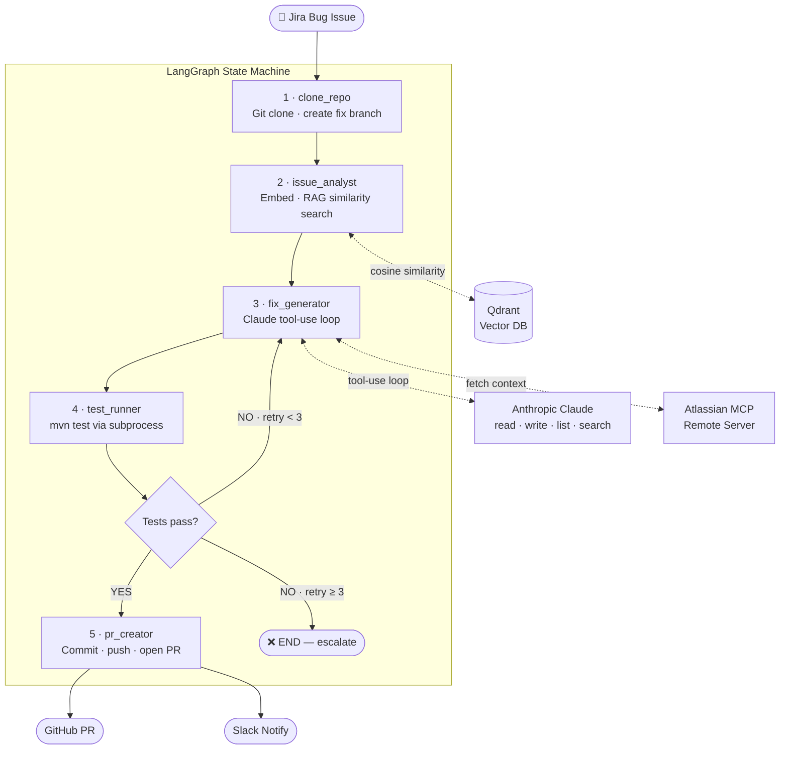

<div align="center">

<h1>🤖 BugPilot</h1>

<p><strong>Autonomous AI agent that reads Jira, writes code fixes, validates with tests, and opens PRs — zero humans in the loop until review.</strong></p>

<p>
  
  
  
  
  
  
</p>

</div>

---

## What it does

BugPilot is a **multi-agent AI pipeline** that completely automates the bug-fix workflow from ticket to PR:

1. **Reads** open Jira bugs via the Atlassian Remote MCP Server
2. **Searches** a vector database for semantically similar past issues (RAG)
3. **Generates** a code fix by giving Claude real filesystem access — it explores and patches the repo autonomously
4. **Validates** the fix by running your Maven test suite
5. **Opens** a GitHub PR with full context, retrying up to 3× if tests fail
6. **Notifies** your team on Slack when a fix is ready for review

```
$ python main.py --issue PROJ-456

============================================================
Processing: PROJ-456 — NullPointerException in OrderService
============================================================
[issue_analyst] Embedding issue → 384-dim vector...
[issue_analyst] Similar past issues found:
  · PROJ-201 NullPointerException in CartService        (score: 0.91)
  · PROJ-334 NPE when user has no active session        (score: 0.84)
[fix_generator] Starting Claude tool-use loop for PROJ-456...
[fix_generator] Tool call: list_files(['extension'])
[fix_generator] Tool call: read_file(['src/main/java/OrderService.java'])
[fix_generator] Tool call: write_file(['src/main/java/OrderService.java', ...])
[fix_generator] Claude finished — end_turn reached
[test_runner] Running mvn test (attempt 1)...
[test_runner] Tests PASSED
[pr_creator] Pushing branch fix/ai-PROJ-456...
[pr_creator] PR created: https://github.com/org/repo/pull/42
[pr_creator] Slack notification sent

[main] Result: AWAITING_APPROVAL — https://github.com/org/repo/pull/42
```

---

## Architecture


---

## Quick Start

**Prerequisites:** Python 3.11+, Maven, Docker, an Anthropic API key, Atlassian OAuth token, GitHub token.

```bash
# 1. Clone and install
git clone https://github.com/rkhichar94/bugpilot && cd bugpilot
pip install -r requirements.txt

# 2. Configure
cp .env.example .env   # fill in ANTHROPIC_API_KEY, ATLASSIAN_MCP_TOKEN, GITHUB_TOKEN, REPO_URL

# 3. Start Qdrant
docker run -d -p 6333:6333 qdrant/qdrant

# 4. Run
python main.py --issue PROJ-123    # single issue
python main.py                     # all open bugs matching your JQL filter
```

---

## How It Works — End to End

**Input:** Jira ticket `PROJ-456` — *"NullPointerException in OrderService when cart is empty"*

### 1 · `clone_repo`
Clones the target repo into `/tmp/bug-resolver-workspace/PROJ-456/` and creates an isolated branch `fix/ai-PROJ-456`. Every issue gets its own branch — parallel processing, clean main, easy review.

### 2 · `issue_analyst`
Concatenates summary + description + stacktrace, embeds it into a **384-dimensional vector** using `all-MiniLM-L6-v2`, and runs a cosine similarity search against Qdrant. Returns the top-3 semantically closest past issues with their resolutions. The current issue is upserted so it feeds future lookups.

```
[PROJ-201] NullPointerException in CartService (score: 0.91)
[PROJ-334] NPE when user has no active session  (score: 0.84)
```

### 3 · `fix_generator` ← the core
Claude receives a system prompt with the bug report and similar issue resolutions, then enters an **agentic tool-use loop**:

```python
while stop_reason != "end_turn":
    response = client.messages.create(tools=TOOL_DEFINITIONS, messages=messages)
    for tool_call in response.tool_use_blocks:
        result = TOOL_DISPATCH[tool_call.name](**tool_call.input)
        messages.append(tool_result(tool_call.id, result))
```

Claude autonomously calls `list_files` → `read_file` → `read_file` → `write_file`, patches the null-check in `OrderService.java`, and signals `end_turn`. No guidance needed — it navigates like a developer.

### 4 · `test_runner`
Runs `mvn test -q` via subprocess. Parses `BUILD SUCCESS` / `BUILD FAILURE`. On failure, the exact failing test names and stack traces are injected back into Claude's context for the next attempt. Up to **3 retry cycles**.

### 5 · `pr_creator`
Stages changes, commits with a semantic message, pushes the branch, opens a GitHub PR with the fix description + test results + referenced past issues, and fires a Slack notification.

---

## AI & ML Concepts

<details>
<summary><strong>Retrieval-Augmented Generation (RAG)</strong></summary>

Bug reports are embedded into a shared vector space using `all-MiniLM-L6-v2`. At query time, cosine similarity retrieves the top-3 most semantically similar past issues — even when keywords differ. *"Connection pool exhaustion"* matches *"too many open database handles"* because the embedding captures meaning. This grounds Claude in your team's real historical fixes rather than hallucinated guesses.

</details>

<details>
<summary><strong>Multi-Agent Orchestration</strong></summary>

The pipeline is decomposed into five single-responsibility agents: `clone_repo`, `issue_analyst`, `fix_generator`, `test_runner`, `pr_creator`. Each agent owns one concern and communicates only through a shared `AgentState` TypedDict. This separation means any agent can be replaced, tested in isolation, or scaled independently — a core property of production-grade agentic systems.

</details>

<details>
<summary><strong>LangGraph State Machine</strong></summary>

LangGraph models the pipeline as a directed graph with typed state. Conditional edges handle the retry loop declaratively:

```python
graph.add_conditional_edges("test_runner", route_after_tests, {
    "fix_generator": "fix_generator",   # retry
    "pr_creator": "pr_creator",          # success
    END: END,                            # max retries
})
```

No `if/else` in application code — the graph topology *is* the control flow.

</details>

<details>
<summary><strong>Claude Tool-Use Loop</strong></summary>

The fix generator uses the Anthropic Messages API with tool definitions for `read_file`, `write_file`, `list_files`, and `search_in_files`. Claude decides *which* tools to call, *in what order*, and *when to stop* — the application code only executes tool calls and feeds results back. This is the difference between a prompted LLM and a true agent.

</details>

<details>
<summary><strong>Atlassian Remote MCP Server</strong></summary>

Jira integration uses the Atlassian Remote MCP Server (`https://mcp.atlassian.com/v1/mcp`) via Anthropic's beta MCP client — no `python-jira` REST wrapper needed. Claude calls the Jira MCP tools directly with an OAuth token, receiving structured issue data as native tool results.

</details>

---

## Tech Stack

| Layer | Technology |
|---|---|
| Agent orchestration | [LangGraph](https://github.com/langchain-ai/langgraph) + LangChain |
| LLM | Anthropic Claude `claude-sonnet-4-6` |
| Vector store | [Qdrant](https://qdrant.tech/) (local Docker) |
| Embeddings | `sentence-transformers` · `all-MiniLM-L6-v2` (384-dim) |
| Jira integration | Atlassian Remote MCP Server + Anthropic beta SDK |
| GitHub integration | `PyGithub` + `GitPython` |
| Test execution | `subprocess` → `mvn test` |
| Observability | LangSmith (env-var gated) |
| Config | `pydantic-settings` + `.env` |

---

## Project Structure

```
bugpilot/
├── main.py                  # CLI — single issue or batch JQL
├── config.py                # pydantic-settings (all env vars)
├── .env.example
├── requirements.txt
│
├── graph/
│   └── orchestrator.py      # LangGraph StateGraph + conditional edges
│
├── agents/
│   ├── issue_analyst.py     # embed + Qdrant RAG search
│   ├── fix_generator.py     # Claude tool-use agentic loop
│   ├── test_runner.py       # mvn test + output parsing
│   └── pr_creator.py        # git commit + GitHub PR + Slack
│
├── rag/
│   ├── embedder.py          # sentence-transformers wrapper
│   └── retriever.py         # Qdrant upsert + similarity search
│
├── tools/
│   ├── repo_tools.py        # read_file · write_file · list_files · search_in_files
│   └── jira_tools.py        # Atlassian MCP client (fetch + search + comment)
│
└── tests/
    ├── test_embedder.py
    ├── test_repo_tools.py
    └── test_graph.py        # mock-based graph flow + routing tests
```

---

## Tests

```bash
pytest tests/ -v
```

All external calls (Qdrant, Claude, GitHub, Git) are stubbed with `unittest.mock`. The suite runs **fully offline** — no credentials required.

---

## Environment Variables

| Variable | Required | Default | Description |
|---|---|---|---|
| `ANTHROPIC_API_KEY` | ✅ | — | Anthropic API key |
| `ATLASSIAN_MCP_TOKEN` | ✅ | — | Atlassian OAuth token for MCP server |
| `JIRA_PROJECT_KEY` | ✅ | — | e.g. `PROJ` |
| `GITHUB_TOKEN` | ✅ | — | Personal access token (`repo` scope) |
| `REPO_URL` | ✅ | — | Full HTTPS URL of target repository |
| `JIRA_JQL_FILTER` | ➖ | `issuetype=Bug AND status=Open` | JQL for batch mode |
| `REPO_DEFAULT_BRANCH` | ➖ | `main` | Base branch for PRs |
| `CLAUDE_MODEL` | ➖ | `claude-sonnet-4-6` | Override the Claude model |
| `QDRANT_URL` | ➖ | `http://localhost:6333` | Qdrant instance URL |
| `QDRANT_COLLECTION` | ➖ | `bug_issues` | Vector collection name |
| `WORKSPACE_DIR` | ➖ | `/tmp/bug-resolver-workspace` | Clone directory |
| `SLACK_WEBHOOK_URL` | ➖ | — | Incoming webhook for PR notifications |
| `LANGCHAIN_TRACING_V2` | ➖ | `false` | Enable LangSmith tracing |
| `LANGCHAIN_API_KEY` | ➖ | — | Required when tracing is on |

---

## Roadmap

- [ ] **Neo4j code graph** — Index the repo as `files → classes → methods → calls` so the fix generator can navigate call stacks semantically, not just linearly
- [ ] **Multi-language** — Abstract `test_runner` behind a strategy interface; add Gradle, pytest, and npm runners
- [ ] **LLM judge** — Post-fix second Claude call that evaluates the patch for correctness, security, and style before tests run
- [ ] **Web UI** — React dashboard with live pipeline status, diff preview, and one-click approve/reject per PR
- [ ] **Incremental embedding** — Sync full closed-issue history from Jira on first run to pre-populate Qdrant with a rich resolution base

---

<div align="center">
<sub>Built with Anthropic Claude · LangGraph · Qdrant · Python 3.11</sub>
</div>
